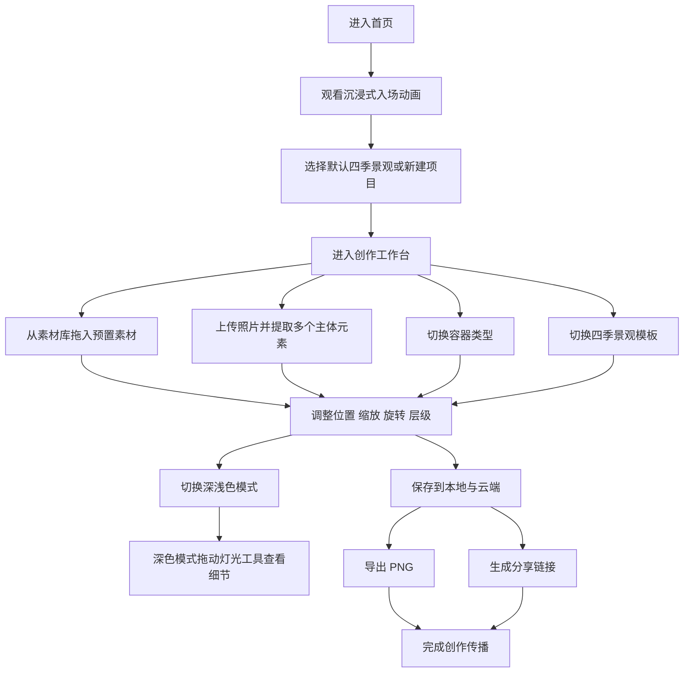

## 1. 产品概述
3D微观景象创作平台是一款面向大众创作者与审美型用户的沉浸式 Web 创作工具，用户可在不同容器中搭建四季微景观、上传照片提取元素，并导出高质量作品。
- 核心目标是把“高审美微缩景观展示”与“低门槛 DIY 创作编辑器”结合在同一平台中，兼顾观赏性、创作性与分享传播能力。
- 产品价值在于提供具有差异化视觉记忆点的 3D 创作体验，并为后续素材商业化、会员体系、模板市场与社交分享提供基础。

## 2. 核心功能

### 2.1 用户角色
| 角色 | 注册方式 | 核心权限 |
|------|----------|----------|
| 游客用户 | 无需注册 | 浏览默认景观、进入体验模式、进行有限本地试创作 |
| 注册用户 | 邮箱/短信/第三方登录 | 创建项目、云端保存、上传照片、导出 PNG、生成分享链接、管理作品 |
| 管理员 | 后台账号 | 管理默认模板、素材库、分享内容与运营数据 |

### 2.2 功能模块
1. **首页 / 沉浸入口页**：入场动画、动态背景、默认四季景观入口、容器预览、主题切换入口。
2. **创作工作台**：3D 场景、容器切换、景观切换、素材拖拽、照片提取元素、灯光工具、撤销重做、保存与导出。
3. **我的项目页**：项目列表、默认景观复制、继续编辑、删除项目、版本状态与更新时间。
4. **登录注册页**：账号注册、登录、找回方式、首次进入引导。
5. **分享展示页**：作品预览、基础信息、只读交互、分享落地。

### 2.3 页面明细
| 页面名称 | 模块名称 | 功能说明 |
|-----------|-----------|-----------|
| 首页 | 沉浸开场动画 | 用户进入网站后逐步显现背景、容器、标题与进入创作按钮，避免传统导航布局 |
| 首页 | 四季景观入口 | 展示春、夏、秋、冬 4 组默认景观缩略入口，切换时同步更换场景动态背景 |
| 首页 | 容器预览区 | 展示玻璃瓶、长方体、球体等容器样式，建立“容器宇宙”认知 |
| 创作工作台 | 3D 场景视口 | 支持左右旋转查看不同角度、滚轮缩放、平滑惯性反馈、点击选中元素 |
| 创作工作台 | 左侧场景面板 | 切换景观、创建新景观、查看用户项目、自建项目删除与编辑、默认项目复制 |
| 创作工作台 | 素材库面板 | 平台预置植物、石块、桥、亭、动物、地表装饰等可拖入素材 |
| 创作工作台 | 照片上传与提取 | 用户上传照片后自动识别并尽可能提取多个主体，生成可拖入的拟 3D 元素卡片 |
| 创作工作台 | 容器管理 | 切换容器类型，自动适配内部裁切范围、相机构图与反射质感 |
| 创作工作台 | 灯光与主题工具 | 深浅色模式切换，深色模式下启用可拖动灯光控制工具，调整光照方向与强度 |
| 创作工作台 | 操作工具栏 | 撤销、重做、复制、删除、对齐、缩放、导出 PNG、生成分享链接 |
| 我的项目页 | 项目卡片列表 | 展示默认复制项目、自建项目、草稿状态、云端状态与最近编辑时间 |
| 我的项目页 | 项目管理 | 删除、重命名、复制、进入编辑器继续创作 |
| 登录注册页 | 认证模块 | 账号登录、注册、会话持久化、登录后同步本地草稿到云端 |
| 分享展示页 | 只读作品展示 | 以沉浸式背景和可交互 3D/拟 3D 预览方式展示作品，不开放编辑 |

## 3. 核心流程
用户进入首页后，通过动画进入微景观世界，选择四季默认景观或新建景观后进入创作工作台；在工作台中切换容器、拖入素材、上传照片提取元素并调整灯光与构图；完成后可本地保存、云端保存、导出 PNG 或生成分享链接。

默认四季景观属于只读模板，用户只能通过复制模板生成可编辑副本；用户自建景观支持继续编辑和删除；手机端仅开放切换景观、缩放查看与简单摆放，不提供完整专业编辑器能力。

## 4. 用户界面设计
### 4.1 设计风格
- 主风格为“自然拟物 + 高级雾面玻璃 + 微观叙事感”，强调精致、柔光、浅景深、真实材质与轻奢展示感。
- 浅色模式主色建议为樱花粉、苔藓绿、暖日光金、雾白灰；深色模式主色建议为深墨绿、午夜蓝、暖金高光、低饱和冷灰。
- 按钮采用圆角实体与毛玻璃混合样式，重要操作按钮具备光晕和微位移动效。
- 字体建议使用具有展示感的英文衬线标题与高可读中文正文字体组合，形成艺术展陈气质。
- 页面布局以“左侧功能面板 + 中央沉浸式主视口 + 右下角工具簇”为核心，不采用传统顶栏导航结构。
- 图标建议采用精致拟物小图标或轻插画风格，四季入口保持强识别度。

### 4.2 页面设计概览
| 页面名称 | 模块名称 | UI 元素 |
|-----------|-----------|-----------|
| 首页 | 沉浸入口 | 全屏动态背景、中央主容器、逐层显现标题、柔和景深粒子、无传统导航 |
| 首页 | 四季入口 | 带季节小图标与名称的悬浮胶囊按钮、选中状态高亮边框与背景发光 |
| 创作工作台 | 左侧面板 | 毛玻璃悬浮卡片、项目切换列表、素材分类网格、上传入口、折叠/展开动效 |
| 创作工作台 | 3D 视口 | 容器居中展示、环境景深、可点交互提示、拖放落位反馈、元素选中边框 |
| 创作工作台 | 工具区 | 深浅模式切换、灯光方向控制、强度滑杆、导出按钮、分享按钮 |
| 我的项目页 | 项目列表 | 大图卡片预览、状态徽标、最近编辑信息、复制/删除/编辑操作 |
| 分享展示页 | 作品页 | 去编辑化、沉浸式背景、只读旋转缩放、分享信息与返回入口 |

### 4.3 响应式策略
- 采用桌面优先设计，桌面端提供完整创作功能。
- 平板端保留大部分创作能力，优化触控拖拽、面板折叠与手势缩放。
- 手机端采用“浏览 + 轻编辑”模式，仅支持景观切换、缩放查看、简单摆放与分享，不提供复杂图层管理和高级灯光编辑。
- 所有端均需保证四季背景切换、容器预览与作品展示的视觉一致性。

### 4.4 3D 场景指导
- 环境与情绪：春季偏樱花晨雾、夏季偏晴空热带、秋季偏金色暖阳、冬季偏冷调静雪；背景与容器内部氛围保持联动。
- 灯光布置：默认使用主方向光 + 环境光 + 轮廓补光；深色模式启用可拖动虚拟主光源，允许用户观察景观细节。
- 相机策略：相机围绕容器中心受限旋转，支持滚轮连续缩放，禁止破坏构图的极端俯仰角。
- 构图重点：容器位于主视觉中心，微景观主元素在黄金分割附近布置，保留足够呼吸感。
- 交互动效：切换容器、切换四季、拖入素材、上传提取、灯光移动都需要带缓动和过渡反馈。
- 后处理效果：景深、柔光、轻微泛光、环境雾、屏幕空间环境光遮蔽可按设备能力分层启用。
- 资产与性能：默认模板优先使用轻量化资产；用户上传照片提取的元素需自动压缩与多级分辨率处理，保证移动端可浏览。

## 5. 默认内容规划
### 5.1 默认四季景观
| 景观名称 | 视觉特征 | 背景联动 |
|-----------|-----------|-----------|
| 春之苏醒 | 樱花树、苔藓石阶、浅水池、小亭、粉白花瓣 | 樱花树林与柔和晨光背景 |
| 夏日绿洲 | 热带树、清澈水面、阳光反射、小岛与鲜绿色植被 | 蓝天强日照与热带环境背景 |
| 秋色物语 | 橙黄树木、落叶、暖石路、木桥、夕照色温 | 暖金树林与晚霞氛围背景 |
| 冬日静谧 | 雪地、冰面、冷调枯树、积雪结构、薄雾 | 冷蓝雪林与静雪背景 |

### 5.2 默认容器体系
| 容器类型 | 用途定位 | 视觉特征 |
|-----------|-----------|-----------|
| 玻璃瓶 | 经典陈列型 | 透明、折射、展示感强，适合默认封面视觉 |
| 长方体容器 | 展陈型 | 更适合横向布局和建筑类景观 |
| 球体容器 | 收藏型 | 适合做雪景、森林与中心聚焦构图 |
| 半开放台座 | 创作型 | 弱化封闭容器感，适合大型 DIY 排布 |

## 6. 非功能需求
- 首屏需要有显著的品牌级入场动画，但需控制可交互等待时间，避免影响进入效率。
- 3D 操控需要流畅自然，目标桌面端交互帧率稳定，切换景观时避免明显卡顿。
- 默认模板不可编辑不可删除，只允许复制为副本后继续创作。
- 导出 PNG 需要保证高分辨率清晰度；分享链接需支持公开只读访问和基础 SEO 元信息。
- 照片识别需以“尽可能多主体提取”为目标，但首版优先保证常见植物、石头、人物、动物、小物件的识别稳定性与可用性。
