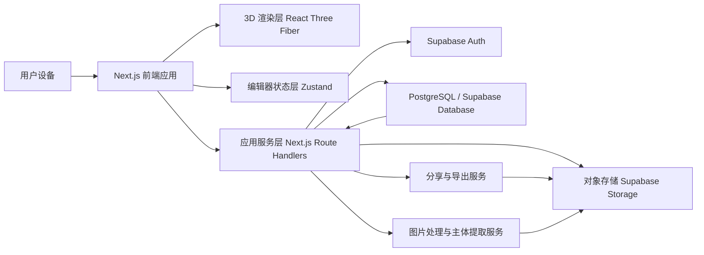
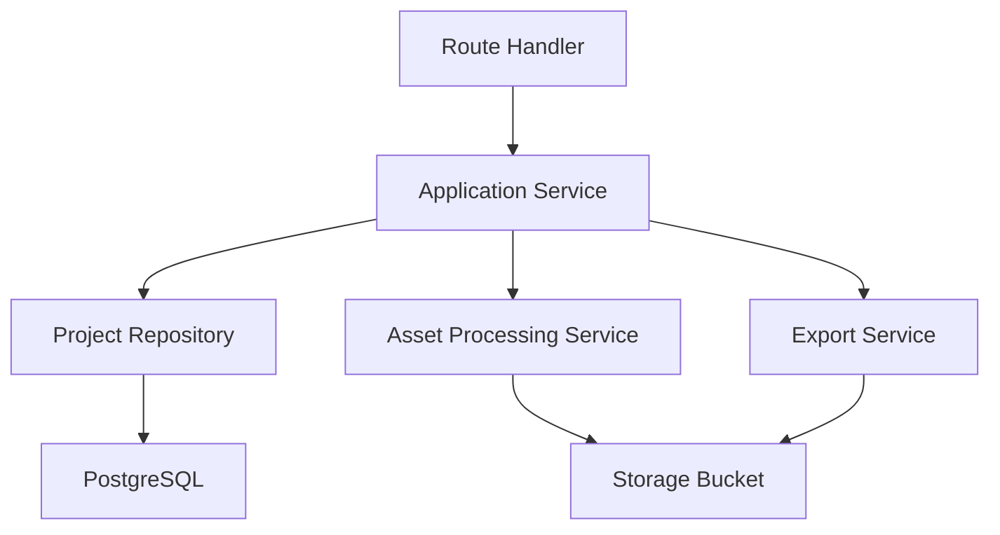
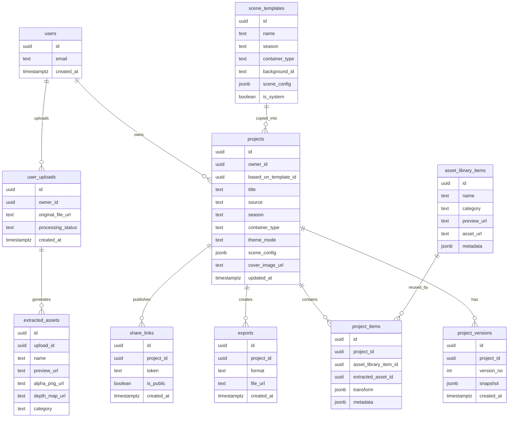

## 1. 架构设计
平台采用前后端一体化 Web 架构：前端负责沉浸式 UI、3D 渲染与编辑器交互；服务端负责身份认证、项目持久化、上传处理、分享发布与导出任务；对象存储保存用户图片、提取结果与导出文件。



## 2. 技术说明
- 前端框架：`Next.js` + `React` + `TypeScript`
- 3D 引擎：`three` + `@react-three/fiber` + `@react-three/drei` + `@react-three/postprocessing`
- 样式方案：`Tailwind CSS` + CSS Variables + 动效增强样式层
- 动效方案：`Framer Motion`
- 状态管理：`Zustand`
- 表单与校验：`React Hook Form` + `Zod`
- 身份认证：`Supabase Auth`
- 数据库：`PostgreSQL（Supabase）`
- 文件存储：`Supabase Storage`
- 图片处理：服务端图片压缩、主体分割、可选深度估计、前端拟 3D 封装
- 初始化工具：`create-next-app`
- 部署方案：前端与 API 部署到 `Vercel`，数据与存储托管在 `Supabase`

## 3. 路由定义
| 路由 | 用途 |
|------|------|
| `/` | 沉浸式首页，展示入场动画、四季景观入口与容器预览 |
| `/auth` | 登录、注册、账号恢复、首次同步引导 |
| `/studio/[projectId]` | 创作工作台，支持 3D 编辑、素材拖拽、容器切换、灯光控制 |
| `/projects` | 我的项目页，查看云端项目、本地同步状态、复制与删除 |
| `/share/[token]` | 只读分享页，用于公开展示作品 |

## 4. API 定义
### 4.1 类型定义
```ts
export type SeasonType = "spring" | "summer" | "autumn" | "winter";
export type ContainerType = "jar" | "cuboid" | "sphere" | "pedestal";
export type ProjectSource = "template_copy" | "user_created";
export type ThemeMode = "light" | "dark";

export interface ProjectItemTransform {
  position: [number, number, number];
  rotation: [number, number, number];
  scale: [number, number, number];
}

export interface ProjectItem {
  id: string;
  assetId: string;
  type: "preset" | "user_extracted";
  transform: ProjectItemTransform;
  metadata?: Record<string, unknown>;
}

export interface LightSettings {
  enabled: boolean;
  intensity: number;
  azimuth: number;
  elevation: number;
}

export interface ProjectSceneConfig {
  season: SeasonType;
  container: ContainerType;
  backgroundId: string;
  themeMode: ThemeMode;
  cameraDistance: number;
  light: LightSettings;
}

export interface ProjectDocument {
  id: string;
  ownerId: string;
  title: string;
  source: ProjectSource;
  basedOnTemplateId?: string;
  scene: ProjectSceneConfig;
  items: ProjectItem[];
  coverImageUrl?: string;
  updatedAt: string;
}
```

### 4.2 接口列表
| 方法 | 接口 | 用途 |
|------|------|------|
| `POST` | `/api/auth/sync-local` | 登录后把本地草稿合并到云端 |
| `GET` | `/api/templates` | 获取四季默认模板与容器配置 |
| `POST` | `/api/projects` | 新建项目或复制默认模板生成副本 |
| `GET` | `/api/projects` | 获取用户项目列表 |
| `GET` | `/api/projects/:id` | 获取单个项目详情 |
| `PATCH` | `/api/projects/:id` | 更新项目标题、场景配置与元素布局 |
| `DELETE` | `/api/projects/:id` | 删除用户自建项目或模板副本 |
| `POST` | `/api/assets/extract` | 上传照片，识别并提取多个主体元素 |
| `GET` | `/api/assets/library` | 获取预置素材库 |
| `POST` | `/api/exports/png` | 生成并保存高清 PNG 导出任务 |
| `POST` | `/api/shares` | 生成分享链接 |
| `GET` | `/api/shares/:token` | 获取分享作品只读数据 |

### 4.3 关键请求/响应示例
```ts
export interface CreateProjectRequest {
  title: string;
  season?: SeasonType;
  container?: ContainerType;
  templateId?: string;
}

export interface ExtractAssetsResponse {
  uploadId: string;
  extractedAssets: Array<{
    id: string;
    name: string;
    previewUrl: string;
    alphaPngUrl: string;
    depthMapUrl?: string;
    suggestedCategory: "flora" | "rock" | "structure" | "figure" | "other";
  }>;
}

export interface ShareLinkResponse {
  token: string;
  shareUrl: string;
  expiresAt?: string;
}
```

## 5. 服务端架构图


## 6. 数据模型
### 6.1 数据模型定义


### 6.2 数据定义语言
```sql
create table scene_templates (
  id uuid primary key default gen_random_uuid(),
  name text not null,
  season text not null check (season in ('spring', 'summer', 'autumn', 'winter')),
  container_type text not null check (container_type in ('jar', 'cuboid', 'sphere', 'pedestal')),
  background_id text not null,
  scene_config jsonb not null,
  is_system boolean not null default true
);

create table projects (
  id uuid primary key default gen_random_uuid(),
  owner_id uuid not null references auth.users(id) on delete cascade,
  based_on_template_id uuid references scene_templates(id),
  title text not null,
  source text not null check (source in ('template_copy', 'user_created')),
  season text not null check (season in ('spring', 'summer', 'autumn', 'winter')),
  container_type text not null check (container_type in ('jar', 'cuboid', 'sphere', 'pedestal')),
  theme_mode text not null default 'light' check (theme_mode in ('light', 'dark')),
  scene_config jsonb not null,
  cover_image_url text,
  updated_at timestamptz not null default now()
);

create table project_versions (
  id uuid primary key default gen_random_uuid(),
  project_id uuid not null references projects(id) on delete cascade,
  version_no int not null,
  snapshot jsonb not null,
  created_at timestamptz not null default now()
);

create table user_uploads (
  id uuid primary key default gen_random_uuid(),
  owner_id uuid not null references auth.users(id) on delete cascade,
  original_file_url text not null,
  processing_status text not null default 'queued',
  created_at timestamptz not null default now()
);

create table extracted_assets (
  id uuid primary key default gen_random_uuid(),
  upload_id uuid not null references user_uploads(id) on delete cascade,
  name text not null,
  preview_url text not null,
  alpha_png_url text not null,
  depth_map_url text,
  category text not null default 'other'
);

create table asset_library_items (
  id uuid primary key default gen_random_uuid(),
  name text not null,
  category text not null,
  preview_url text not null,
  asset_url text not null,
  metadata jsonb not null default '{}'::jsonb
);

create table project_items (
  id uuid primary key default gen_random_uuid(),
  project_id uuid not null references projects(id) on delete cascade,
  asset_library_item_id uuid references asset_library_items(id),
  extracted_asset_id uuid references extracted_assets(id),
  transform jsonb not null,
  metadata jsonb not null default '{}'::jsonb
);

create table exports (
  id uuid primary key default gen_random_uuid(),
  project_id uuid not null references projects(id) on delete cascade,
  format text not null check (format in ('png')),
  file_url text not null,
  created_at timestamptz not null default now()
);

create table share_links (
  id uuid primary key default gen_random_uuid(),
  project_id uuid not null references projects(id) on delete cascade,
  token text not null unique,
  is_public boolean not null default true,
  created_at timestamptz not null default now()
);

create index idx_projects_owner_updated_at on projects(owner_id, updated_at desc);
create index idx_project_items_project_id on project_items(project_id);
create index idx_extracted_assets_upload_id on extracted_assets(upload_id);
create index idx_share_links_token on share_links(token);
```

## 7. 前端模块拆分
| 模块 | 说明 |
|------|------|
| `app/(marketing)` | 首页与沉浸式入口 |
| `app/studio/[projectId]` | 创作工作台路由 |
| `features/studio/scene` | 四季模板、容器、背景、灯光和 3D 场景装配 |
| `features/studio/editor` | 拖拽、选择、变换、撤销重做、移动端轻编辑规则 |
| `features/assets` | 预置素材库与用户提取素材管理 |
| `features/projects` | 项目列表、复制、删除、保存与版本策略 |
| `features/share` | 分享页与公开访问逻辑 |
| `lib/api` | 与 Route Handlers、Supabase 交互的统一客户端 |

## 8. 实施阶段建议
1. 第一阶段：完成项目初始化、设计系统、默认四季场景、容器体系、首页与工作台骨架。
2. 第二阶段：接入账号系统、项目保存、默认模板复制规则、项目管理页。
3. 第三阶段：完成素材拖拽、照片上传提取、拟 3D 元素封装与移动端轻编辑。
4. 第四阶段：接入 PNG 导出、分享链接、性能优化、细节动效与上线部署。
